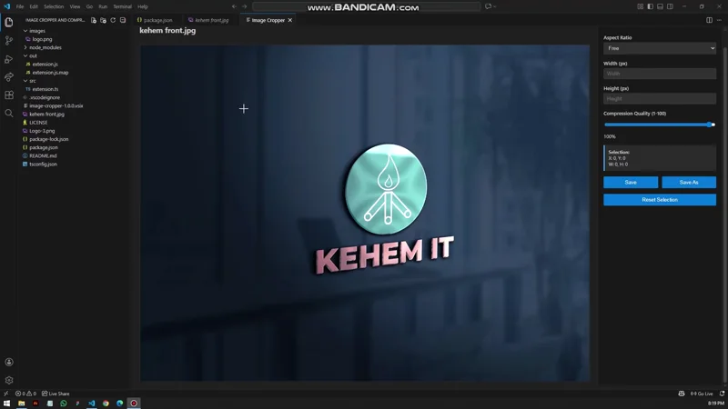
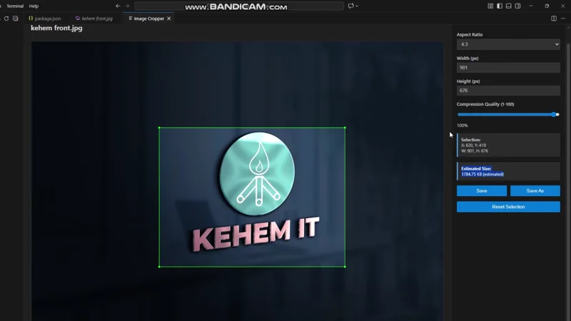

# 🖼️ Image Cropper & Compressor

A powerful VS Code extension for cropping and compressing images with precision and ease.

---

## ✨ Features

| Feature | Description |
|---------|-------------|
| 🎯 **Smart Cropping** | Click and drag to select any area with live preview |
| 📐 **Aspect Ratios** | Preset ratios (1:1, 4:3, 16:9, 3:2) or custom dimensions |
| 🗜️ **Compression** | Adjustable quality (1-100%) to optimize file size |
| 💾 **Flexible Saving** | Overwrite original or save as new file |
| 📊 **Size Preview** | See estimated file size before saving |

**Supported Formats:** PNG, JPG, JPEG, GIF, BMP, WEBP

---

## 🎬 Demos

### Crop Image

### Compress Image

---

## 🚀 Quick Start

1. **Right-click** any image file in VS Code
2. Select **"Crop Image"** from the menu
3. **Click and drag** to select your desired area
4. **Adjust settings** in the right panel:
   - Choose aspect ratio or enter custom dimensions
   - Adjust compression quality with the slider
5. **Save** or **Save As** your cropped image

---

## ⚙️ Settings Panel

- **Aspect Ratio Presets:** Free, 1:1, 4:3, 16:9, 3:2
- **Custom Dimensions:** Width × Height in pixels
- **Quality Control:** 1-100% compression slider
- **Live Preview:** Selection coordinates and estimated file size

---

## 🛠️ Technical Stack

- **Language:** TypeScript
- **Image Processing:** Sharp library
- **UI:** Canvas-based selection with VS Code Webview API

---

## 📄 License

MIT

---

## 🤝 Contributing

Issues and pull requests are welcome! Feel free to contribute to make this extension even better.

---

Made with ❤️ for VS Code
